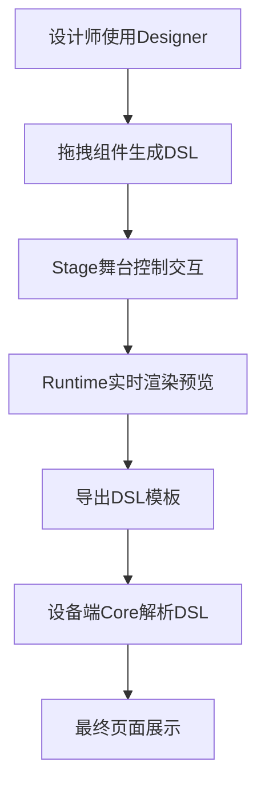

huangyan321: 我现在授予你阅读该代码库的所有权限，请你以最大程度理解项目整体的运行工作方式，以及最终的构建产物呈现给用户的页面内容

GitHub Copilot: 基于对代码库的深入分析，我来详细解释这个低代码平台的整体运行工作方式和最终呈现给用户的页面内容：

## 项目整体架构理解

这是一个**医疗行业低代码可视化设计平台**，采用Monorepo架构，主要解决医疗设备界面定制化需求。

### 核心工作流程



## 关键技术架构分层

### 1. **编辑器层 (Designer Layer)**
- **designer**: 可视化设计器主界面
  - 顶部工具栏：保存、预览、缩放控制
  - 左侧组件库：按钮、文本、图片等UI组件
  - 中间画布：实时设计预览区域
  - 右侧属性面板：组件属性配置、样式设置、事件绑定

### 2. **舞台控制层 (Stage Layer)**
- **stage**: 画布交互核心
  ```typescript
  // 核心功能包括
  - 组件拖拽、缩放、旋转 (基于Moveable.js)
  - 多选操作 (Ctrl/Cmd + 点击)
  - 蒙层控制 (StageMask) - 拦截用户操作
  - 高亮选中 (highlight)
  - 参考线对齐
  ```

### 3. **运行时层 (Runtime Layer)**
- **core**: 渲染核心引擎
  - 设备适配：根据屏幕分辨率计算缩放比例
  - DSL解析：将JSON配置转换为实际DOM
  - 事件系统：组件间联动通信
  
- **runtime-ui**: UI组件库
  - 基础组件：Button、Text、Image、Container等
  - 组件注册：自动注册为`low-code-runtime-ui-xx`形式

### 4. **数据模型层 (Schema Layer)**
- **schema**: DSL数据结构定义
  ```typescript
  interface MNode {
    id: string;
    type: string;
    name: string;
    style: CSSProperties;
    events: Event[];
    items?: MNode[];
  }
  ```

## 最终呈现给用户的页面内容

### 1. **设计器界面** (playground/index.html)
````html
<!doctype html>
<html lang="zh-CN">
  <head>
    <title>Medical Designer Playground</title>
  </head>
  <body>
    <div id="app"></div> <!-- Vue应用挂载点 -->
  </body>
</html>
````

### 2. **用户操作体验**
- **拖拽式设计**：从左侧组件库拖拽组件到画布
- **所见即所得**：实时预览设计效果
- **多设备适配**：支持不同分辨率设备显示
- **智能辅助**：集成LLM大语言模型辅助设计

### 3. **最终产物**
- **DSL模板数据**：JSON格式的页面描述文件
- **设备端页面**：通过Core引擎解析DSL生成的实际界面
- **多框架支持**：可生成Vue2/Vue3/React页面

## 核心技术特点

### 1. **多设备适配方案**
```typescript
// 不使用REM，采用动态缩放
calcZoomRatio(page: Page): void {
  const templateWidth = Number(page.data.style!.width);
  const templateHeight = Number(page.data.style!.height);
  const { width: screenWidth, height: screenHeight } = document.documentElement.getBoundingClientRect();
  
  this.zoomRatio = {
    x: screenWidth / templateWidth,
    y: screenHeight / templateHeight,
  };
}
```

### 2. **设计稿解析优化**
- **访问者模式**：解析Figma JSON为DSL
- **异步处理**：避免阻塞主线程
- **缓存优化**：减少重复解析

### 3. **组件通信机制**
- **事件系统**：基于EventEmitter的组件联动
- **Stage-Runtime通信**：iframe或直接渲染两种模式
- **实时同步**：设计器操作实时反映到预览

## 构建产物

通过build.mjs构建：
- **UMD格式**：浏览器直接引用
- **ES模块**：现代构建工具使用
- **类型声明**：TypeScript支持
- **样式文件**：CSS/SCSS编译

这个平台最终为医疗设备提供了一个完整的可视化界面定制解决方案，让非技术人员也能快速创建专业的设备界面。

huangyan321: 你能详细解释dsl数据是如何在系统中流转的吗？

Workspace: 正在收集工作区信息基于我对您工作空间的分析，我来详细解释DSL数据在低代码系统中的流转过程：

## DSL数据流转架构概览

DSL（Domain Specific Language）数据是整个低代码系统的核心，它描述了页面的层级结构、样式、事件等信息。以下是DSL数据的完整流转过程：

## 1. DSL数据生成阶段

### 设计稿解析 → DSL
- **输入源**：Figma JSON、蓝湖等设计稿数据
- **处理模块**：`packages/adapter` 和 parser
- **核心功能**：将设计稿的JSON树形结构转换为标准DSL格式

```typescript
// 典型的DSL结构（来自playground配置）
{
  id: '75f0extui9d7yksklx27hff8xg',
  name: 'test',
  type: 'app',
  items: [
    {
      type: 'page',
      id: 'page_299',
      name: 'index',
      title: '',
      layout: 'absolute',
      style: { /* 样式配置 */ },
      events: [],
      items: [
        {
          type: 'qrcode',
          id: 'qrcode_37ddc840',
          style: { /* 组件样式 */ },
          // 其他属性
        }
      ]
    }
  ]
}
```

## 2. 编辑器层的DSL操作

### 可视化编辑
- **设计器界面**：designer 提供可视化编辑界面
- **舞台控制**：stage 处理拖拽、选中、缩放等交互
- **实时同步**：编辑操作会实时修改DSL数据结构

### 存储管理
- **本地存储**：通过 storage.service.ts 管理DSL数据的持久化
- **版本控制**：支持DSL数据的保存、读取、清理等操作

## 3. 运行时层的DSL解析

### 核心渲染流程
1. **DSL接收**：`packages/runtime` 接收DSL数据
2. **核心处理**：core 负责：
   - 设备适配和尺寸兼容
   - 样式解析和计算
   - 事件系统注册
3. **组件渲染**：runtime-ui 提供实际的UI组件

### 多框架适配
正如 README.md 中提到的：
> 项目通过模板设计最终产物是DSL数据，运行时层根据DSL数据生成实际页面，所以只需要设计不同框架的DSL解析器，将DSL数据解析为对应框架的组件树即可。

## 4. 设备适配与渲染一致性

### 动态缩放机制
```markdown
1. 通过设计图的固定尺寸来搭建页面（如1024*600）
2. 设备渲染时，core结合DSL模板尺寸和设备分辨率计算缩放比例
3. runtime解析DSL组件样式时，根据缩放比例动态调整尺寸、位置
```

## 5. 智能增强层的DSL处理

### AI辅助功能
- **LLM集成**：llm 提供智能对话能力
- **DSL生成**：通过 `useMessageOption` 等函数支持AI辅助DSL生成
- **智能优化**：AI可以分析和优化DSL结构

## 6. 表单系统的DSL扩展

### 表单配置
schema.ts 定义了表单相关的DSL扩展：
```typescript
export interface FormState {
  config: FormConfig;
  initValues: FormValue;
  values: FormValue;
  // 其他表单状态
}
```

## DSL数据流转的关键特点

### 1. 双向同步
- 编辑器修改 → DSL更新 → 运行时同步渲染
- 运行时状态变化 → DSL状态更新 → 编辑器界面同步

### 2. 事件驱动
通过DSL中的事件配置实现组件间联动：
```typescript
{
  events: [
    {
      trigger: 'click',
      target: 'component_id',
      action: 'callback_function'
    }
  ]
}
```

### 3. 性能优化
为了优化DSL解析性能，系统采用了：
- 数据结构优化
- 异步处理
- 缓存机制
- WebWorker处理

### 4. 扩展性设计
DSL结构设计支持：
- 多种组件类型（page、container、text、img等）
- 灵活的样式系统
- 可扩展的事件机制
- 插件化的组件注册

这种DSL驱动的架构确保了整个低代码系统的一致性、可维护性和扩展性，使得不同层级的模块都能基于统一的数据格式进行协作。

huangyan321: 请你思考，该系统有何可以扩展的功能模块？

GitHub Copilot: 基于对该低代码系统的深入分析，我识别出以下可扩展的功能模块：

## 1. 数据源管理模块 (Data Source Module)

### 当前痛点
- 系统缺乏统一的数据源管理
- 组件数据主要依赖静态配置

### 扩展方案
````typescript
// packages/data-source/src/types.ts
interface DataSource {
  id: string;
  name: string;
  type: 'api' | 'database' | 'mock' | 'file';
  config: {
    url?: string;
    method?: 'GET' | 'POST';
    headers?: Record<string, string>;
    transform?: string; // 数据转换脚本
  };
}

interface DataBinding {
  componentId: string;
  dataSourceId: string;
  fieldMapping: Record<string, string>;
}
````

### 功能特性
- 可视化数据源配置
- 实时数据预览
- 数据字段映射
- 支持RESTful API、GraphQL、数据库连接

## 2. 模板市场模块 (Template Marketplace)

### 扩展价值
- 提升设计效率
- 建立行业最佳实践
- 促进组件复用

### 架构设计
````typescript
// packages/template-market/src/schema.ts
interface TemplateInfo {
  id: string;
  name: string;
  category: 'medical' | 'dashboard' | 'form' | 'chart';
  preview: string;
  dsl: MNode;
  tags: string[];
  downloads: number;
  rating: number;
  author: string;
  createdAt: Date;
}

interface TemplateMarket {
  search(keyword: string, category?: string): Promise<TemplateInfo[]>;
  install(templateId: string): Promise<MNode>;
  publish(template: TemplateInfo): Promise<void>;
}
````

## 3. 主题系统模块 (Theme System)

### 当前局限
- 样式配置较为分散
- 缺乏统一的主题管理

### 扩展设计
````typescript
// packages/theme/src/types.ts
interface ThemeConfig {
  id: string;
  name: string;
  colors: {
    primary: string;
    secondary: string;
    background: string;
    surface: string;
    text: string;
  };
  typography: {
    fontFamily: string;
    fontSize: Record<string, number>;
    fontWeight: Record<string, number>;
  };
  spacing: Record<string, number>;
  borderRadius: Record<string, number>;
  shadows: Record<string, string>;
}
````

### 功能特性
- 主题切换预览
- 自定义主题编辑器
- 主题导入/导出
- 品牌主题定制

## 4. 多语言国际化模块 (i18n Module)

### 扩展必要性
- 医疗设备面向全球市场
- 需要支持多语言切换

### 实现方案
````typescript
// packages/i18n/src/core.ts
interface I18nConfig {
  defaultLocale: string;
  locales: string[];
  messages: Record<string, Record<string, string>>;
}

// DSL中的文本国际化
interface TextNode extends MNode {
  type: 'text';
  props: {
    text: string | { [locale: string]: string };
    i18nKey?: string;
  };
}
````

## 5. 协作与版本控制模块 (Collaboration Module)

### 扩展价值
- 支持多人协作设计
- 版本历史管理
- 冲突解决机制

### 架构设计
````typescript
// packages/collaboration/src/types.ts
interface ProjectVersion {
  id: string;
  dsl: MNode;
  author: string;
  message: string;
  timestamp: Date;
  parentVersion?: string;
}

interface CollaborationService {
  createBranch(name: string): Promise<void>;
  mergeBranch(source: string, target: string): Promise<void>;
  getHistory(): Promise<ProjectVersion[]>;
  realtimeSync(changes: DSLChange[]): void;
}
````

## 6. 性能监控模块 (Performance Monitor)

### 监控指标
- 页面加载时间
- 组件渲染性能
- 内存使用情况
- 用户交互响应时间

### 实现方案
````typescript
// packages/monitor/src/performance.ts
interface PerformanceMetrics {
  pageLoadTime: number;
  componentRenderTime: Record<string, number>;
  memoryUsage: number;
  fcp: number; // First Contentful Paint
  lcp: number; // Largest Contentful Paint
}

class PerformanceMonitor {
  collect(): PerformanceMetrics;
  report(metrics: PerformanceMetrics): void;
  optimize(suggestions: OptimizationSuggestion[]): void;
}
````

## 7. 自动化测试模块 (Testing Framework)

### 扩展需求
- 自动化UI测试
- 兼容性测试
- 性能回归测试

### 架构设计
````typescript
// packages/testing/src/types.ts
interface TestCase {
  id: string;
  name: string;
  dsl: MNode;
  assertions: Assertion[];
  devices: DeviceConfig[];
}

interface TestRunner {
  run(testCase: TestCase): Promise<TestResult>;
  generateReport(results: TestResult[]): TestReport;
  screenshot(selector: string): Promise<Buffer>;
}
````

## 8. 插件生态模块 (Plugin Ecosystem)

### 当前状态
- 系统具备一定的可扩展性
- 缺乏标准化的插件开发框架

### 扩展方案
````typescript
// packages/plugin-system/src/types.ts
interface PluginManifest {
  name: string;
  version: string;
  description: string;
  main: string;
  dependencies: Record<string, string>;
  capabilities: ('component' | 'datasource' | 'export')[];
}

interface PluginAPI {
  registerComponent(component: ComponentConfig): void;
  registerDataSource(source: DataSourceConfig): void;
  registerExporter(exporter: ExportConfig): void;
  getDesignerContext(): DesignerContext;
}
````

## 9. 代码生成优化模块 (Code Generation Enhancement)

### 当前能力
- 基本的DSL到代码转换
- 支持多框架导出

### 扩展方向
````typescript
// packages/codegen/src/enhanced.ts
interface CodeGenConfig {
  framework: 'vue2' | 'vue3' | 'react' | 'angular';
  typescript: boolean;
  cssFramework: 'tailwind' | 'bootstrap' | 'antd';
  bundler: 'webpack' | 'vite' | 'rollup';
  optimizations: {
    treeshaking: boolean;
    codesplitting: boolean;
    lazyLoading: boolean;
  };
}
````

## 10. 智能助手增强模块 (AI Assistant Enhancement)

### 基于现有LLM模块扩展
````typescript
// packages/ai-assistant/src/enhanced.ts
interface AICapabilities {
  designSuggestion: (dsl: MNode) => Promise<DesignSuggestion[]>;
  codeReview: (code: string) => Promise<ReviewComment[]>;
  autoLayout: (components: MNode[]) => Promise<MNode>;
  accessibilityCheck: (dsl: MNode) => Promise<A11yIssue[]>;
  performanceOptimize: (dsl: MNode) => Promise<OptimizedDSL>;
}
````

## 实施优先级建议

### 高优先级 (短期)
1. **数据源管理模块** - 解决核心数据绑定需求
2. **主题系统模块** - 提升用户体验一致性
3. **性能监控模块** - 保障系统稳定性

### 中优先级 (中期)
1. **模板市场模块** - 提升生产效率
2. **多语言国际化模块** - 扩大市场覆盖
3. **自动化测试模块** - 保障代码质量

### 低优先级 (长期)
1. **协作与版本控制模块** - 团队协作需求
2. **插件生态模块** - 生态建设
3. **智能助手增强模块** - AI能力深化

这些扩展模块将大大增强系统的实用性、稳定性和市场竞争力，使其从一个基础的低代码平台演进为企业级的可视化开发解决方案。